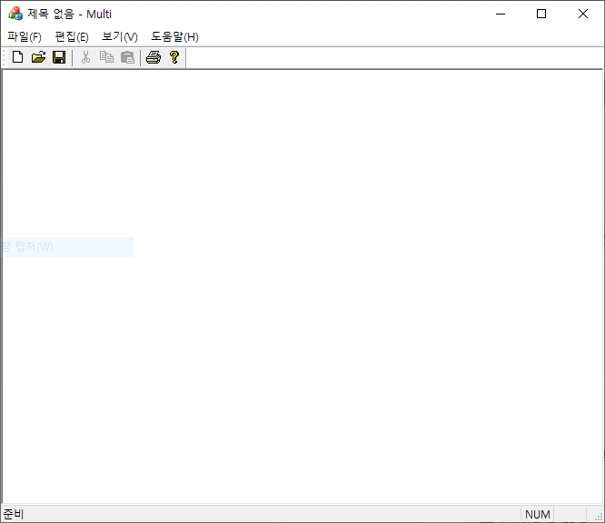
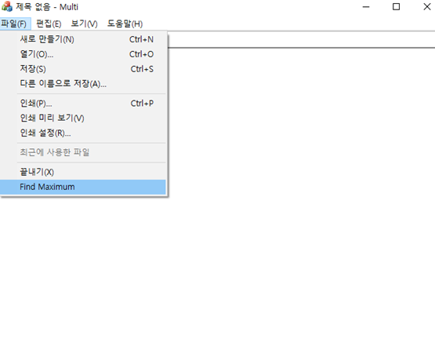
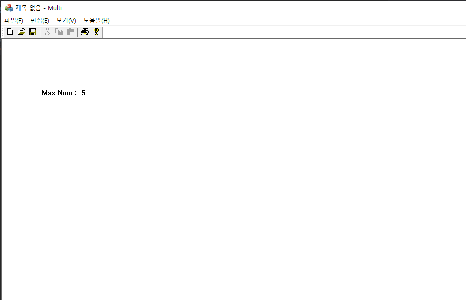
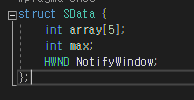
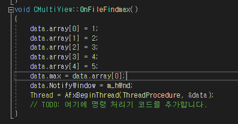
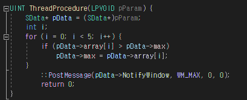

# Multi

## 실행 결과

1.

첫 화면입니다.

2.

Find Maximum 을 실행합니다.

Find Maximum 을 실행하게 되면

내부에 선언되어 있는 Array 배열에서

가장 큰 값을 찾아내어 출력합니다.

3.

1,2,3,4,5 중 가장 큰 값인 5를 찾아낸 모습입니다.

--------------------------------------------------------------------------------------------

